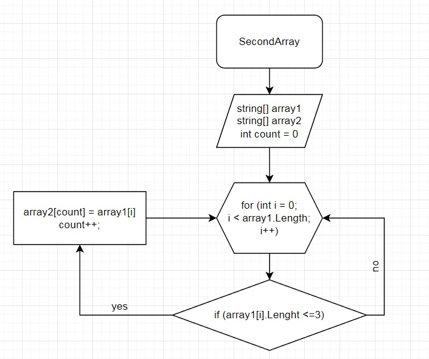

# Итоговая проверочная работа

## Задача :
Написать программу, которая из имеющегося массива строк 
формирует массив из строк, длина которых меньше либо равна 3 символа. Первоначальный массив можно ввести с клавиатуры, либо задать на старте выполнения алгоритма. 
При решение не рекомендуется пользоваться коллекциями, лучше обойтись исключительно массивами

## Описание решения:
Объявляем два массива одинаковой длины.  
Создаем метод, с циклом равным длине массива,  
внутри цикла проверка условия ( <=3 ),  
если да элемент первого массива заносится в count элемент второго массива.  
После присвоения увеличивается переменная count на 1 и возвращается к циклу for в котором i увеличивается на 1.  
И так проверяем до конца.

